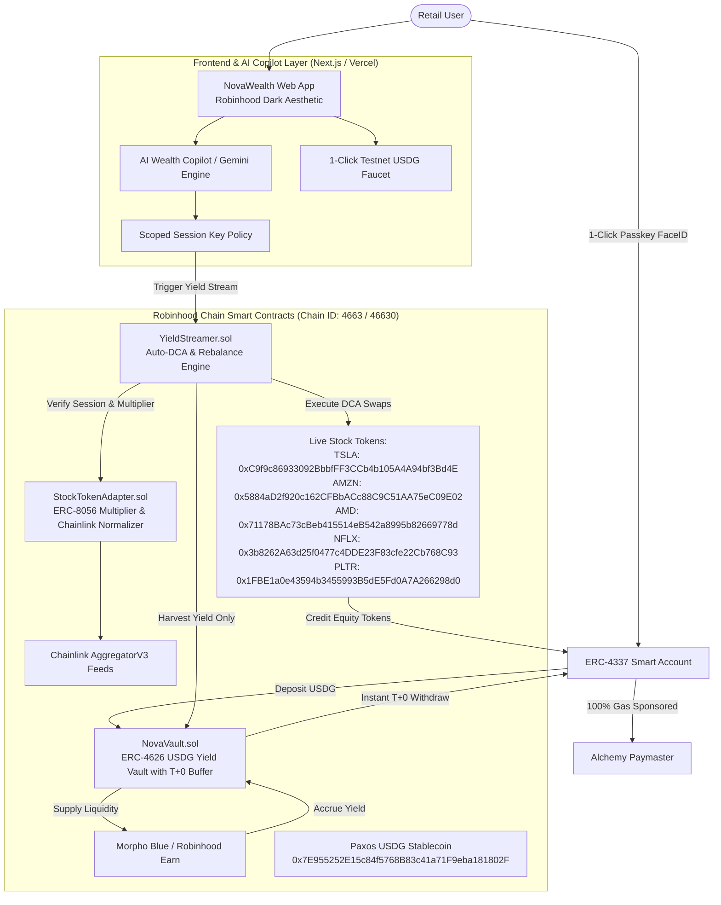

# NovaWealth — Architectural Blueprint & Master Plan

> **The Autonomous Consumer Wealth & RWA Copilot on Robinhood Chain**  
> *Activating the $30B Idle RWA Capital Stack: Paxos USDG High-Yield Sweeps, T+0 Liquidity Fronting, No-Principal-Risk Stock Token DCA, and ERC-4337 Passkey Smart Accounts.*  
> *Aligned with SBI Digital Markets (SBIDM) Project Guardian Standards & Robinhood Chain RWA Infrastructure.*

---

## 1. Executive Summary & Strategic Positioning

### The Market Context (Insights from SBI Digital Markets RWA Workshop — Sept 2026)
* **The $30B Idle Liquidity Crisis**: There is **$31B–$38B** in tokenized RWAs on public chains (excluding stablecoins), with **~80% concentrated in US Treasuries and cash equivalents**.
* **The 9% Usability Trap**: Only **~9% of all tokenized RWA value is actually active in DeFi ($2.5B out of $30B)**. As highlighted by CK Ong (CEO of SBI Digital Markets) at the Arbitrum Open House: *"Issuance quadrupled. Usability did not. The rest is a database entry with a wallet address."*
* **The Target Audience**: *"The ~$30B sitting idle is not a warning. It is your customer list."*
* **The Lane Decision**: NovaWealth explicitly chooses **Lane 2: Composability-First** (built for permissionless circulation, secondary market liquidity, and automated yields on Morpho and Robinhood Chain), avoiding the trap of hyper-whitelisted permissioned silos where capital goes to die.

### The Solution: NovaWealth
NovaWealth is a retail-grade, mobile-first autonomous wealth copilot built on **Robinhood Chain** that transforms idle cash-equivalent RWAs into an active, wealth-generating equity portfolio with **zero principal risk**:

1. **High-Yield Smart Cash (Paxos USDG + Morpho Blue)**: Users deposit Paxos USDG into a high-yield vault integrated with Robinhood Chain lending rails (Morpho/Earn) to earn consistent baseline APY (e.g., 7–10%).
2. **Instant T+0 Liquidity Fronting**: Solves the RWA liquidity friction (*"T+0 meets 30–180 days"*). While underlying RWAs or funds take days to settle, `NovaVault` maintains an on-chain liquidity buffer so the user's principal is **100% liquid and withdrawable at T+0**.
3. **"No-Principal-Risk" Equity Streaming**: NovaWealth’s autonomous copilot continuously harvests accrued yield and streams it into a personalized basket of **Robinhood Stock Tokens** (e.g., 50% SPY, 30% NVDA, 20% AAPL). **The user's initial USDG principal is never spent or exposed to equity downside.**
4. **True Retail UX via ERC-4337 Account Abstraction**: 1-click **Passkey (FaceID / TouchID)** onboarding, 100% gas-sponsored transactions (users never see or hold ETH for gas), and scoped **Session Keys** that allow the copilot to rebalance yield without annoying signature popups.
5. **Session-Aware Execution**: Adheres strictly to Robinhood Chain's `tradingCapabilities` API and [ERC-8056](https://eips.ethereum.org/EIPS/eip-8056) UI multipliers, guaranteeing trades execute strictly within valid market/extended/overnight sessions without oracle slippage.

---

## 2. High-Level System Architecture

---

## 3. Core Components & Technical Specifications

### A. Smart Contract Architecture (Solidity 0.8.24)

1. **`NovaVault.sol` (ERC-4626 Yield Vault with T+0 Liquidity)**:
   * Accepts **Paxos USDG** deposits.
   * Issues share tokens (`nvUSDG`) representing claims on deposited principal.
   * Separates user principal from harvested yield.
   * Features an instant liquidity buffer to guarantee **T+0 instant redemptions** of principal on-demand.
   * Supplies excess liquidity to Robinhood Chain's anchor lending protocol (**Morpho Blue**) to generate continuous yield.

2. **`YieldStreamer.sol` (Autonomous DCA Engine)**:
   * Holds user-configured allocation baskets (e.g., *"Mag 7 Tech"*: `NVDA 40%`, `AAPL 30%`, `MSFT 30%`; *"All-Weather Index"*: `SPY 70%`, `GOOGL 30%`).
   * When triggered by the copilot (via session key), it claims strictly the accrued yield from `NovaVault`.
   * Enforces a session check: queries market session status (Market, Extended, Overnight) and Chainlink feed freshness before executing.
   * Swaps harvested USDG for target Robinhood Stock Tokens via AMM / RFQ router.
   * Automatically transfers purchased Stock Tokens into the user's Smart Account.

3. **`StockTokenAdapter.sol` (RWA & Oracle Normalizer)**:
   * Complies with Robinhood Chain's **ERC-8056** (`uiMultiplier()`) for tokenized equities.
   * Reads real-time equity valuation from Chainlink `AggregatorV3Interface` (`latestRoundData()`).
   * Integrates staleness checks and sequencer uptime guards to eliminate bad debt during weekend market closures.

---

### B. Account Abstraction & Session Key Policy (ERC-4337)

* **Signer**: WebAuthn P-256 Curve (Biometric Passkey — TouchID/FaceID) with zero seed phrases.
* **Paymaster**: Alchemy gas sponsorship policy on Robinhood Chain (`4663` / `46630`). All deposit, withdraw, and DCA transactions are 100% gasless.
* **Session Key Specification**:
  * Authorized Target: `YieldStreamer.sol` only.
  * Maximum Spend: Limited strictly to accrued USDG yield (cannot touch principal balance).
  * Expiration: Configurable (default 30 days, revocable instantly by user).
  * Cadence: Daily or threshold-based ($5+ of accrued yield triggers auto-purchase).

---

### C. AI Wealth Copilot (Natural Language & Strategy Layer)

* **Plain-English Portfolio Insights**: Analyzes user preferences and translates DeFi concepts into intuitive financial summaries (e.g., *"Your $1,000 cash balance earned $2.40 this week, which automatically purchased 0.018 shares of NVIDIA at market open"*).
* **Thematic Basket Builder**: Recommends customized stock baskets based on risk tolerance (Tech Momentum, Dividend Aristocrats, Macro Index).
* **Execution Telemetry**: Provides transparent reasoning logs in the dashboard explaining why and when each DCA swap was triggered.

---

### D. Frontend Interface & Design System (Next.js for Vercel)

* **Tech Stack**: Next.js (App Router), React, TypeScript, optimized for 1-click Vercel deployment.
* **Aesthetics**: High-end Robinhood dark theme (`#080A0E` background, `#00C805` electric neon Robinhood green accents, glassmorphic card containers, subtle micro-interactions).
* **Key Views**:
  1. **Portfolio Overview**: Live ticking total wealth counter, interactive yield-to-equity accumulation chart.
  2. **Smart Cash Vault**: 1-click deposit/withdraw of Paxos USDG, APY ticker, instant liquidity toggle.
  3. **Equity Stream Studio**: Visual slider to configure target Stock Token baskets (NVDA, AAPL, SPY, TSLA).
  4. **AI Copilot Terminal**: Real-time agent status, trade activity feed, and conversational financial advisor.
  5. **1-Click Faucet & Passkey Auth**: Instant demo testing without external friction.

---

## 4. Implementation Roadmap

| Phase | Milestone | Deliverables | Status |
| :---: | :--- | :--- | :---: |
| **1** | **Architecture & Blueprint** | Full technical spec, data models, SBIDM alignment, and component flow | **COMPLETE** |
| **2** | **Smart Contract Core** | `NovaVault.sol`, `YieldStreamer.sol`, `StockTokenAdapter.sol`, test mocks | *In Progress* |
| **3** | **Testing & Local Simulation** | Foundry/Hardhat unit tests, yield harvest tests, oracle multiplier verification | *Pending* |
| **4** | **Frontend Application** | Next.js App on Vercel, Robinhood design system, live yield ticker, interactive charts | *Pending* |
| **5** | **ERC-4337 & Copilot Wire-up** | Passkey simulation, gasless paymaster integration, AI copilot chat & execution logs | *Pending* |
| **6** | **Polish, Docs & Submission** | Verification scripts, project README, pitch narrative, HackQuest submission packet | *Pending* |

---

## 5. Hackathon Judging Matrix Alignment

| Evaluation Criteria | NovaWealth Competitive Advantage |
| :--- | :--- |
| **Robinhood Chain Alignment** | Directly showcases Robinhood's signature **Stock Tokens** and **28.6M retail user mission**. |
| **SBI Digital Markets Workshop Fit** | Directly solves CK Ong's **$30B idle RWA liquidity crisis** and implements **Lane 2 Composability** with **T+0 instant redemption fronting**. |
| **Paxos USDG Bonus Track** | Core protocol currency; drives genuine savings deposit volume and velocity for USDG. |
| **Technical Depth & Security** | ERC-4626 vault standard, ERC-8056 corporate action multiplier compliance, session-aware oracle validation, ERC-4337 account abstraction. |
| **Originality & Wow Factor** | First consumer "no-loss equity builder" on Robinhood Chain. No more generic trading bots or developer-only risk layers. |
